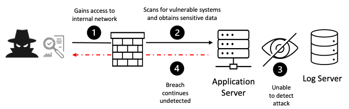
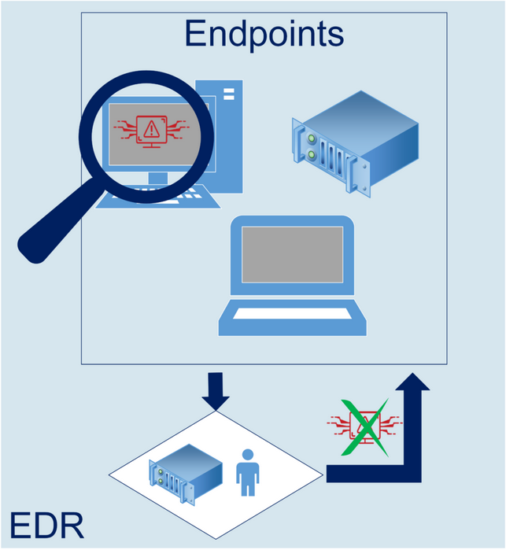
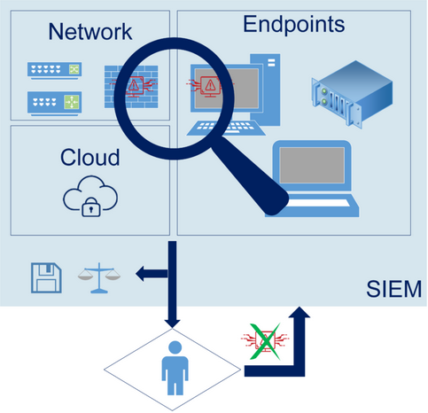
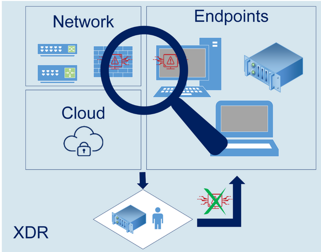
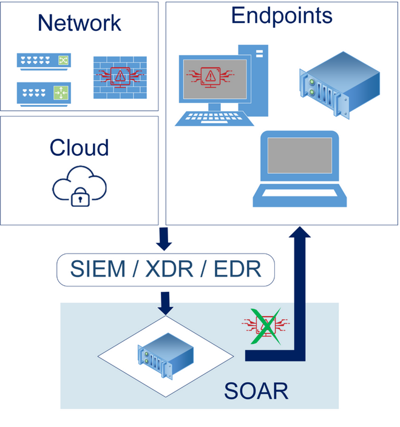
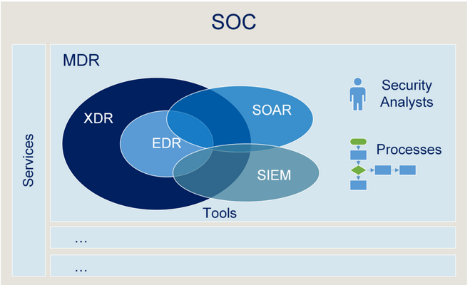

# Security Expert Samenvatting

## Week 2 - AppSec - DevSecOps Principles

## Week 3 - AppSec - DevSecOps Practices

## Week 4 - AppSec - DevSecOps Practices SIEM
### Overview & Description
Logging and monitoring can be challenging to test. There isn't much CVE/CVSS data for this category, but detecting and responding to breaches is critical. Still, it can be very impactful for accountability, visibility, incident alerting, and forensics.

This category is to help detect, escalate, and respond to active breaches. Without logging and monitoring, breaches cannot be detected. Insufficient logging, detection, monitoring, and active response occurs any time:

    - Auditable events, such as logins, failed logins, and high-value transactions, are not logged.
    - Warnings and errors generate no, inadequate, or unclear log messages.
    - Logs of applications and APIs are not monitored for suspicious activity.
    - Logs are only stored locally.
    - Appropriate alerting thresholds and response escalation processes are not in place or effective.
    - Penetration testing and scans by dynamic application security testing (DAST) tools (such as OWASP ZAP) do not trigger alerts.
    - The application cannot detect, escalate, or alert for active attacks in real-time or near real-time.

### How to Prevent
Developers should implement some or all the following controls, depending on the risk of the application:

	- Ensure all login, access control, and server-side input validation failures can be logged **with sufficient user context** to identify suspicious or malicious accounts and **held for enough time** to allow delayed forensic analysis.
	- Ensure that logs are generated in a format that log management solutions can easily consume.
	- Ensure log data is encoded correctly to prevent injections or attacks on the logging or monitoring systems.
	- Ensure high-value transactions have an audit trail with integrity controls to prevent tampering or deletion, such as append-only database tables or similar.
	- DevSecOps teams should establish effective monitoring and alerting such that suspicious activities are detected and responded to quickly.
	- Establish or adopt an incident response and recovery plan, such as National Institute of Standards and Technology (NIST) 800-61r2 or later.
	- There are commercial and open-source application protection frameworks such as the OWASP ModSecurity Core Rule Set, and open-source log correlation software, such as the Elasticsearch, Logstash, Kibana (ELK) stack, that feature custom dashboards and alerting.

### Example of an attack
**Scenario #1:** A health plan provider's website operator couldn't detect a breach due to a lack of monitoring and logging. An external party informed the health plan provider that an attacker had accessed and modified thousands of sensitive health records of more than 3.5 million patients. As there was no logging or monitoring of the system, the data breach could have been in progress since 2013, a period of more than seven years.

### EDR

### SIEM
Security information and event management `(SIEM)` is an approach to security management that combines security information management `(SIM)` and security event management (SEM) functions into one security management system.

### XDR

### SOAR

## Week 5 - InfraSec - Layered Security

## Week 6 - InfraSec - AD Security: Initial flaws

## Week 7 - InfraSec - AD Security: Passwords & Hashes

## Week 8 - InfraSec - AD Security: Kerberos

## Week 9 - InfraSec - AD Security: Azure AD

## Week 10 - InfraSec - AD Security: APT

## Sources

#### Week 4
https://owasp.org/Top10/A09_2021-Security_Logging_and_Monitoring_Failures/
https://www.techtarget.com/searchsecurity/definition/security-information-and-event-management-SIEM
https://sysdig.com/learn-cloud-native/detection-and-response/edr-vs-xdr-siem-vs-mdr-vs-sor/
